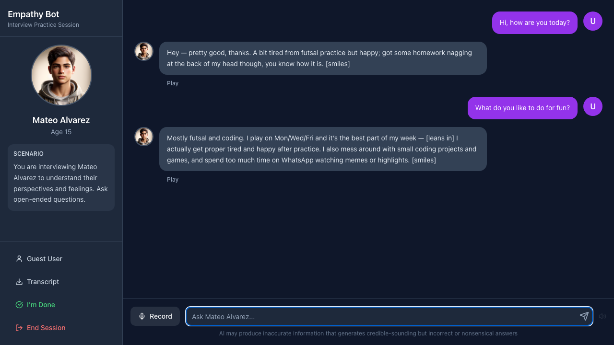
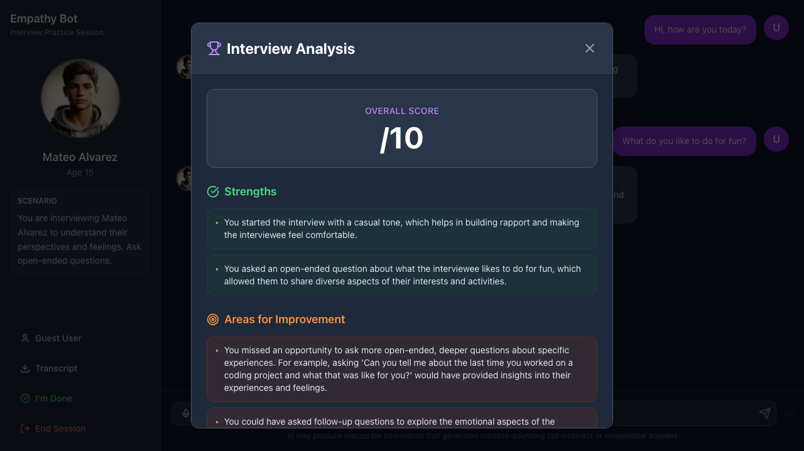
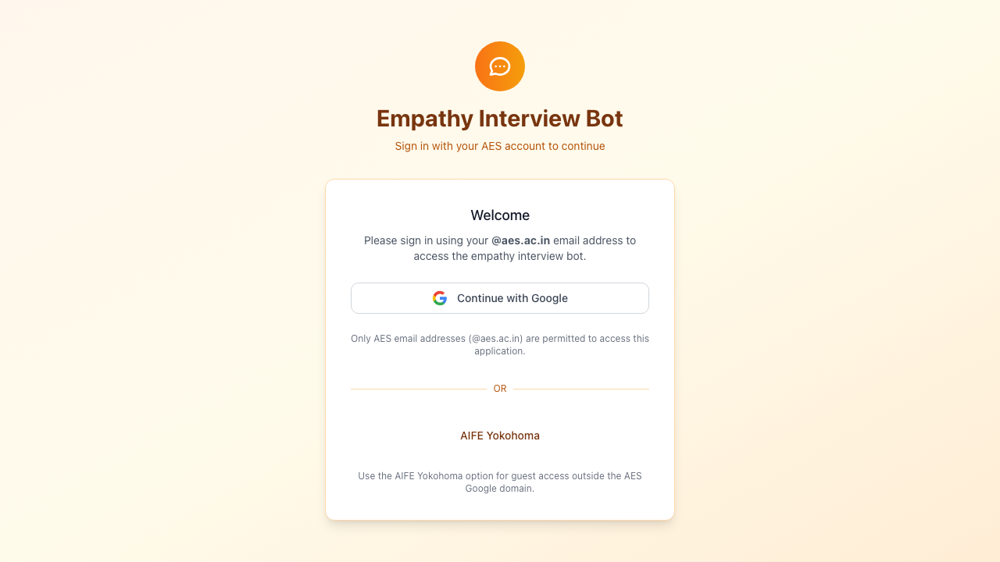

# Empathy Interview Bot

An AI-powered empathy interview practice platform with a Zoom-like dark interface. Practice conducting empathy interviews with AI personas and receive detailed feedback on your interviewing skills.

## Features

### 🎯 AI-Powered Persona
- Generates realistic AI personas with detailed backgrounds
- AI-generated profile images using Imagen 3
- Consistent personality and responses throughout the interview
- Default persona: Mateo Alvarez, a 15-year-old student from Madrid

### 💬 Real-Time Chat Interface
- Dark, professional Zoom-like UI
- Message bubbles with avatars
- Real-time conversation with AI persona
- Chat history persistence via localStorage

### 🎤 Audio Features
- Voice recording for questions
- Text-to-speech for persona responses (OpenAI Echo voice)
- Play/stop controls for audio playback

### 📊 Interview Analysis
- "I'm Done" button to complete interviews
- AI-powered analysis of your empathy interviewing technique
- Feedback includes:
  - Overall score (0-10)
  - Strengths identified
  - Areas for improvement
  - Specific recommendations

### 📥 Transcript Export
- Download conversation transcripts
- Available formats: TXT and PDF
- Includes timestamp and persona details

### 🔐 Authentication
- Google OAuth integration
- Domain restriction (@aes.ac.in)
- Guest access option for AIFE Yokohama

## Tech Stack

- **Framework:** Next.js 14 (App Router)
- **Language:** TypeScript
- **Styling:** Tailwind CSS
- **Authentication:** NextAuth.js with Google OAuth
- **AI/ML:**
  - OpenAI GPT for chat responses
  - OpenAI Whisper for speech-to-text
  - OpenAI TTS (Echo voice) for text-to-speech
  - Google Imagen 3 for persona image generation
- **PDF Generation:** jsPDF

## Getting Started

### Prerequisites

- Node.js 18+ installed
- Google Cloud Project with OAuth credentials
- OpenAI API key
- Google Cloud API key (for Imagen)

### Installation

1. Clone the repository:
```bash
git clone https://github.com/rottnerin/empathy-interview-bot.git
cd empathy-interview-bot
```

2. Install dependencies:
```bash
npm install
```

3. Set up environment variables:

Create a `.env.local` file with the following:

```env
# NextAuth
NEXTAUTH_URL=http://localhost:3000
NEXTAUTH_SECRET=your-secret-key-here

# Google OAuth
GOOGLE_CLIENT_ID=your-google-client-id
GOOGLE_CLIENT_SECRET=your-google-client-secret

# OpenAI
OPENAI_API_KEY=your-openai-api-key

# Google Cloud (for Imagen)
GOOGLE_CLOUD_API_KEY=your-google-cloud-api-key
```

4. Run the development server:
```bash
npm run dev
```

5. Open [http://localhost:3000](http://localhost:3000) in your browser

## Usage

### Starting an Interview

1. Sign in with your Google account (or use Guest Access for AIFE Yokohama)
2. Wait for the AI persona to be generated
3. Begin asking open-ended questions to understand their perspective

### During the Interview

- **Type or Record:** Use the text input or voice recording
- **Listen:** Click "Play" on any AI response to hear it spoken
- **View Scenario:** Check the left sidebar for interview context

### Completing the Interview

1. Click the **"I'm Done"** button when finished
2. Confirm you want to end the session
3. Review your analysis:
   - Overall score
   - Strengths in your approach
   - Areas for improvement

### Downloading Transcripts

1. Click **"Transcript"** in the sidebar
2. Choose **TXT** or **PDF** format
3. File downloads automatically with timestamp

## API Routes

- `/api/auth/[...nextauth]` - NextAuth authentication
- `/api/persona` - Generate AI persona with image
- `/api/chat` - Handle conversation with AI
- `/api/tts` - Text-to-speech conversion
- `/api/chat/stt` - Speech-to-text conversion
- `/api/analyze` - Generate interview feedback

## Project Structure

```
├── src/
│   ├── app/
│   │   ├── api/           # API routes
│   │   ├── auth/          # Auth pages (signin, error)
│   │   ├── globals.css    # Global styles
│   │   ├── layout.tsx     # Root layout
│   │   └── page.tsx       # Main interview interface
│   └── components/
│       ├── audio.tsx      # Recorder & Speaker components
│       ├── ui.tsx         # UI components (Button, Input, etc.)
│       └── SessionProvider.tsx
├── public/
│   └── mateo.png         # Default persona image
└── README.md
```

## Screenshots

### Main Interview Interface

*Dark Zoom-like interface with persona sidebar and chat*

### Interview Analysis

*Detailed feedback with score, strengths, and improvements*

### Sign In Page

*Google OAuth authentication*

## Configuration

### Google OAuth Setup

See [GOOGLE_AUTH_SETUP.md](./GOOGLE_AUTH_SETUP.md) for detailed instructions.

### Customizing the Persona

Edit `/api/persona/route.ts` to customize:
- Persona characteristics
- Background details
- Age range
- Personality traits

### Modifying Analysis Criteria

Edit `/api/analyze/route.ts` to adjust:
- Scoring algorithm
- Feedback categories
- Analysis prompts

## Guest Access

For AIFE Yokohama users:
1. Go to `/auth/signin`
2. Click "Continue as Guest (AIFE Yokohama)"
3. Start interviewing immediately without Google sign-in

## Browser Support

- Chrome/Edge (recommended)
- Firefox
- Safari

**Note:** Voice recording requires HTTPS in production.

## Contributing

1. Fork the repository
2. Create a feature branch (`git checkout -b feature/amazing-feature`)
3. Commit your changes (`git commit -m 'Add amazing feature'`)
4. Push to the branch (`git push origin feature/amazing-feature`)
5. Open a Pull Request

## License

This project is licensed under the MIT License.

## Acknowledgments

- Built with [Next.js](https://nextjs.org/)
- AI powered by [OpenAI](https://openai.com/)
- Image generation by [Google Imagen 3](https://cloud.google.com/vertex-ai/generative-ai/docs/image/overview)
- UI inspired by Zoom's interface design

## Support

For issues, questions, or feature requests, please open an issue on GitHub.

---

**Made with ❤️ for empathy interview practice**
